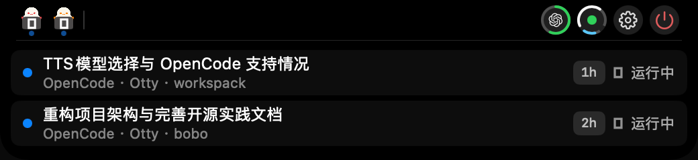
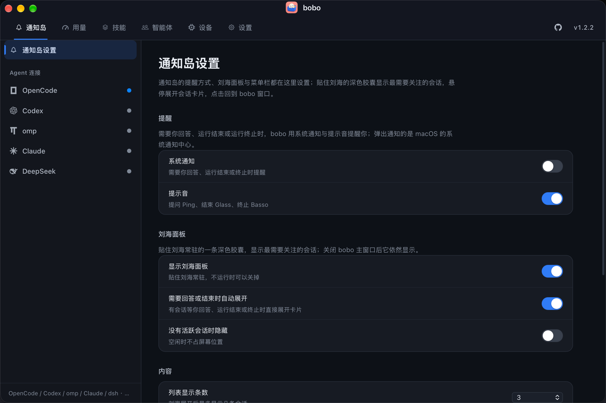

<div align="center">

  

  # bobo

  ***万事通式的本地 Agent 工作台。***

  [](https://github.com/ohmyangboy/bobo/releases)
  [](https://github.com/ohmyangboy/bobo)
  [](LICENSE)

  [Releases](https://github.com/ohmyangboy/bobo/releases) · [问题反馈](https://github.com/ohmyangboy/bobo/issues)

</div>

---

> “it's bobo!”

bobo 是我的一个朋友的昵称，一个万事通。随着各种小工具占据我的 Mac 状态栏，我发现我需要一个像 bobo 一样的万事通工具软件，所以有了 bobo。

bobo 可以说是个融合怪：

1. 通知岛 —— 参考 [CodeIsland](https://github.com/wxtsky/CodeIsland)
2. 额度 —— 参考 [CodexBar](https://github.com/steipete/CodexBar)
3. 系统状态 —— 参考 [stats](https://github.com/exelban/stats)
4. skill —— 参考 [skills](https://github.com/vercel-labs/skills)

当前项目为个人工具项目，可能存在较多兼容问题，大部分场景只兼容到我实际使用的工具，更建议你 fork 后自己加入任何你想要的任何功能。

## 截图

<div align="center">

  
  <br />
  <sub>通知岛 · 折叠：头像是最需要关注的会话，右侧为额度与设备指示</sub>

  <br /><br />

  
  <br />
  <sub>通知岛 · 展开：来自哪家 harness、跑在哪个终端、已经跑了多久</sub>

  <br /><br />

  
  <br />
  <sub>网页界面：通知岛设置与五家 harness 的连接状态</sub>

</div>

## 支持的 harness

以下是目前支持的 harness 列表：

| Harness | 通知岛 | 额度 | 技能 | 智能体 / 全局配置 |
| --- | --- | --- | --- | --- |
| OpenCode | ✅ 事件流实时 | — | 全局技能（读写） | ✅ 智能体定义 + 全局配置 |
| Codex CLI | ✅ 轮询 rollout | ✅ ChatGPT 订阅额度 | 全局技能（链接） | ✅ TOML 智能体 + 全局配置 |
| Claude Code | ✅ 活跃注册表 + 会话日志 | — | 全局技能（链接） | ✅ 全局配置 |
| omp（Oh My Pi） | ✅ 轮询会话文件 | — | 全局技能（链接） | ✅ 全局配置 |
| DeepSeek Harness（dsh） | ✅ 投影缓存 | — | 全局技能（链接） | ✅ 全局配置 |

技能统一落在 `~/.agents/skills`，bobo 直接管理技能目录与各 Agent 的符号链接，不依赖 `npx skills` 或其它命令行工具。

## 安装

**下载安装**：从 [Releases](https://github.com/ohmyangboy/bobo/releases) 下载最新的 `bobo.app.zip`，解压后把 `bobo.app` 拖进「应用程序」；首次打开如果被系统拦下，右键 →「打开」即可。需要本机有 Node.js 22+。

**从源码构建**：

```sh
git clone https://github.com/ohmyangboy/bobo.git
cd bobo
./update.sh                # 构建并安装到 /Applications/bobo.app
npm start                  # 或只跑本地服务 → http://127.0.0.1:4318
```

## 应用内更新

安装版启动后会静默检查 GitHub Release，发现新版本就在后台下载好；在「设置 → 关于」里点一次「重启并更新」即可退出、替换并自动重开（也可以随时手动检查）。源码运行请用 `./update.sh`。

## 功能

- **通知岛**：贴住刘海的常驻胶囊，把 OpenCode、Codex、omp、Claude Code、dsh 的会话状态变成看得见、听得到的提醒；悬停展开会话卡片，点击回到对应终端。
- **额度**：Codex 与 OpenCode Go 的剩余额度（5 小时 / 本周 / 账单月），只读取本机登录与用量，不改写任何凭据。
- **系统状态**：CPU（整机与每核占用、负载）、内存（压力与页统计）、磁盘占用，以及 Top 进程。
- **技能**：阅读、编辑、安装、更新、删除 `~/.agents/skills` 里的全局技能，浏览 SKILL.md 与子文件；「我的 Skill」管理任意本地技能目录并一键同步到 GitHub。
- **智能体**：管理 OpenCode 与 Codex CLI 的自定义智能体定义，阅读并调节五家 harness 的全局配置。
- **AI**：按段落翻译全文、生成能力总结（OpenAI 兼容接口，可用 DeepSeek）。

详细功能与实现说明见 [docs/features.md](docs/features.md)，一页速览见 [docs/intro.md](docs/intro.md)。

## 开发

```sh
npm start      # 本地服务（127.0.0.1:4318，纯 Node 内置模块，无第三方依赖）
npm test       # 全部测试（隔离 HOME，不联网、不使用真实技能）
node --test macos/island-layout.test.mjs   # 刘海几何的 Swift 侧测试（需要 xcrun swift）
npm run package                            # 打包 dist/bobo.app.zip
```

```
src/        服务端模块（Node 内置 http）
test/       服务端测试（Node 内置 test runner）
public/     网页与通知岛面板（原生 HTML / CSS / JS）
macos/      macOS 应用（AppKit + WebKit 壳 Bobo.swift、素材、几何测试）
scripts/    构建（build-app.sh）与发布打包（package-release.mjs）
v2/         跨平台桌面壳（Tauri 2，独立工程，不影响主项目）
```

## 贡献

欢迎 Issue 与 PR，请先读 [CONTRIBUTING.md](CONTRIBUTING.md)。

## 许可

[MIT](LICENSE) © ohmyangboy。第三方资源与参考项目见 [THIRD_PARTY_NOTICES.md](THIRD_PARTY_NOTICES.md)。
